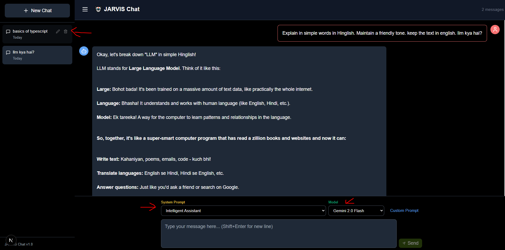
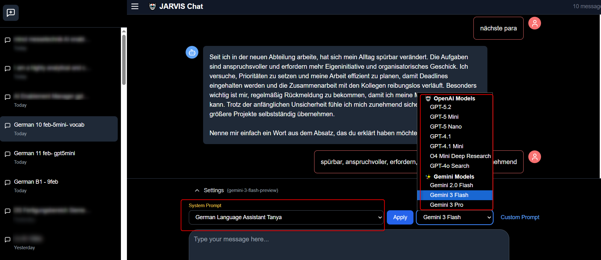

# JARVIS Chat - Next.js + TypeScript

A modern chat application built with Next.js 15 and TypeScript, featuring chat history sidebar and Gemini AI integration.




## 🚀 Features

- ✨ Beautiful, responsive chat UI
- 💬 Real-time chat with Gemini AI
- 📁 Chat history sidebar (stored locally)
- 🔧 Customizable system prompts
- 🤖 Multiple Gemini models

## 📋 Prerequisites

- Node.js 18+ (Download from [nodejs.org](https://nodejs.org/))
- A Gemini API key (Get one at [ai.google.dev](https://ai.google.dev/))

## 🛠️ Setup Instructions

### 1. Install Node.js

If you don't have Node.js installed:
1. Go to https://nodejs.org/
2. Download the LTS version (recommended)
3. Run the installer and follow the prompts
4. Verify installation by opening PowerShell and running:
   ```powershell
   node --version
   npm --version
   ```

### 2. Install Dependencies

Open PowerShell in the project directory and run:

```powershell
npm install
```

This will install all required packages (React, Next.js, TypeScript, Tailwind CSS, etc.)

### 3. Set Up Environment Variables

Create a `.env.local` file in the root directory (or use the existing `.env` file):

1. Create `.env.local` (recommended) or edit `.env`
2. Add your Gemini API key:
   ```
   GEMINI_API_KEY=your_api_key_here
   ```
   
**Important**: Never commit `.env.local` to Git - it contains your secret API key!

### 4. Run the Development Server

```powershell
npm run dev
```

The app will start at http://localhost:3000

Open your browser and navigate to http://localhost:3000

## 📖 Usage

### Starting a New Chat
- Click the "New Chat" button in the sidebar
- Type your message in the text area
- Select a system prompt and model
- Click "Send" or press Enter

### Managing Chats
- **View history**: All chats are listed in the left sidebar
- **Switch chats**: Click on any chat in the sidebar
- **Delete chat**: Hover over a chat and click the trash icon
- **Chat persistence**: All chats are saved locally in your browser

### Customizing Prompts
- Choose from pre-defined system prompts
- Click "Custom Prompt" to type your own
- The prompt is applied to each message

### Keyboard Shortcuts
- **Enter**: Send message
- **Shift + Enter**: New line in message

## 🏗️ Project Structure

```
jarvis-chat/
├── app/
│   ├── api/
│   │   └── chat/
│   │       └── route.ts          # Gemini API integration
│   ├── globals.css               # Global styles
│   ├── layout.tsx                # Root layout
│   └── page.tsx                  # Main chat page
├── components/
│   ├── ChatSidebar.tsx           # Left sidebar with chat history
│   ├── ChatMessages.tsx          # Message display area
│   └── ChatInput.tsx             # Input form with settings
├── lib/
│   ├── chatStorage.ts            # Local storage utilities
│   └── constants.ts              # System prompts and models
├── types/
│   └── chat.ts                   # TypeScript type definitions
├── .env / .env.local             # Environment variables (API key - NOT in Git)
├── .gitignore                    # Files to ignore in Git
├── package.json                  # Dependencies and scripts
├── tsconfig.json                 # TypeScript configuration
└── tailwind.config.ts            # Tailwind CSS configuration
```

## 🎨 Customization

### Adding System Prompts

Edit `lib/constants.ts`:

```typescript
export const SYSTEM_PROMPTS: SystemPrompt[] = [
  {
    label: "Your Label",
    content: "Your prompt content"
  },
  // Add more...
];
```

### Changing Models

Edit `lib/constants.ts`:

```typescript
export const MODELS = [
  { value: "gemini-2.0-flash-exp", label: "Gemini 2.0 Flash" },
  // Add more models...
];
```

### Styling

The app uses Tailwind CSS. To customize colors and styles:
- Edit `tailwind.config.ts` for theme configuration
- Modify component styles directly in `.tsx` files

## 🔧 Available Scripts

- `npm run dev` - Start development server (http://localhost:3000)
- `npm run build` - Build for production
- `npm start` - Start production server
- `npm run lint` - Run ESLint

## 🐛 Troubleshooting

### "Module not found" errors
```powershell
rm -r node_modules
rm package-lock.json
npm install
```

### Port 3000 already in use
```powershell
npm run dev -- -p 3001
```
Or kill the process using port 3000

### API errors
- Check that `.env` or `.env.local` has the correct Gemini API key
- Verify the API key is valid at https://ai.google.dev/
- Make sure the env file is in the root directory
- Restart the dev server after changing env files
- Check browser console (F12) for error messages

### Chat history not saving
- Check browser console for localStorage errors
- Try a different browser
- Clear browser cache and reload

## 📚 Learning Resources

As a beginner, here are helpful resources:

- **Next.js**: https://nextjs.org/learn
- **React**: https://react.dev/learn
- **TypeScript**: https://www.typescriptlang.org/docs/handbook/intro.html
- **Tailwind CSS**: https://tailwindcss.com/docs


## 📄 License

MIT License - Feel free to use and modify!

## 🤝 Support

If you encounter issues:
1. Check the troubleshooting section
2. Review the browser console for errors
3. Verify all dependencies are installed correctly

---

Built with ❤️ using Next.js, TypeScript, and Gemini AI
